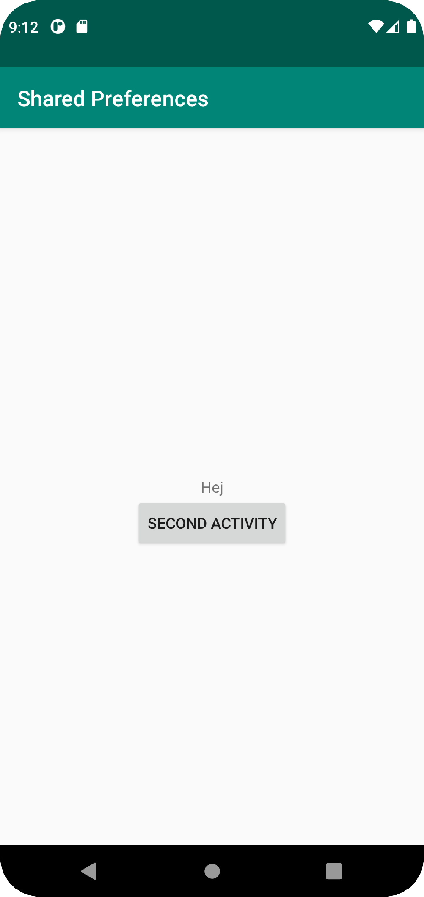

# Rapport

Skapade en knapp som leder till secondactivity och en textview som visar vad som är sparat i shared preferences i Mainactivity.
I secondantivity finns det en edittext och en knapp som sparar det som skrivs i fältet i preferences och avslutar activityn.
När användaren kommer tillbaka till Mainactivity körs metoden `onResume` och då hämtas värdet som sparades i preferences och visas i textviewn.

Nedanstående kod körs när spara knappen i secondactivity klickas på. Då hämtas texten från Edittext fältet och sparas i
preferences med nyckeln `INPUT`. Slutligen så avslutats secondactivityn.
```
    btn.setOnClickListener(View -> {
        EditText input = findViewById(R.id.input);

        myPreferenceEditor.putString("INPUT", input.getText().toString());
        myPreferenceEditor.apply();

        finish();
    });
```




Läs gärna:

- Boulos, M.N.K., Warren, J., Gong, J. & Yue, P. (2010) Web GIS in practice VIII: HTML5 and the canvas element for interactive online mapping. International journal of health geographics 9, 14. Shin, Y. &
- Wunsche, B.C. (2013) A smartphone-based golf simulation exercise game for supporting arthritis patients. 2013 28th International Conference of Image and Vision Computing New Zealand (IVCNZ), IEEE, pp. 459–464.
- Wohlin, C., Runeson, P., Höst, M., Ohlsson, M.C., Regnell, B., Wesslén, A. (2012) Experimentation in Software Engineering, Berlin, Heidelberg: Springer Berlin Heidelberg.
